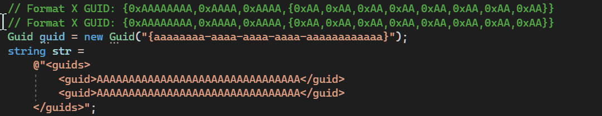

# ReGuid

A Visual Studio 2022 extension. Insert new GUIDs or replace existing GUIDs in the current selection. Works with multiple carets as well as multiple selections.

## Commands

### Insert GUID

 - **Menu Path**: Edit > Insert GUID
 - **Keyboard Shortcut**: Ctrl+Shift+K, Ctrl+Shift+K
 - Inserts a new GUID at the current caret position(s)/selection(s).

### Replace GUIDs in Selection

 - **Menu Path**: Edit > Replace GUIDs in Selection
 - **Keyboard Shortcut**: Ctrl+Shift+Alt+K
 - Replaces existing GUIDs inside the current selection(s) with new GUIDs.
 - Finds uppercase and lowercase GUIDs in five different formats.

## Configuration
 Format | Example
 -------|-----------------------------------------------------------------------
 D      | `00000000-0000-0000-0000-000000000000`
 N      | `00000000000000000000000000000000`
 B      | `{00000000-0000-0000-0000-000000000000}`
 P      | `(00000000-0000-0000-0000-000000000000)`
 X      | `{0x00000000,0x0000,0x0000,{0x00,0x00,0x00,0x00,0x00,0x00,0x00,0x00}}`

### "Insert GUID" Command Options
 - **Case**: Whether to insert GUIDs in uppercase or lowercase. Defaults to lowercase.
 - **Format**: How to format inserted GUIDs. Defaults to format D.
### "Replace GUIDs in Selection" Command Options
 - **Case**: Whether to use uppercase, use lowercase, or attempt to perserve the case of each replaced GUID. Defaults to preserving case.
 - **Format**: Whether to perserve the format of each replaced GUID or use one of the five supported formats. Defaults to preserving format.
 - **Replace Format D GUIDs**: Whether to replace GUIDs that are written in format D.
 - **Replace Format N GUIDs**: Whether to replace GUIDs that are written in format N.
 - **Replace Format B GUIDs**: Whether to replace GUIDs that are written in format B.
 - **Replace Format P GUIDs**: Whether to replace GUIDs that are written in format P.
 - **Replace Format X GUIDs**: Whether to replace GUIDs that are written in format X.

## Change History

- Version 1.1 (2022/02/06)
  - Added configuration options.
